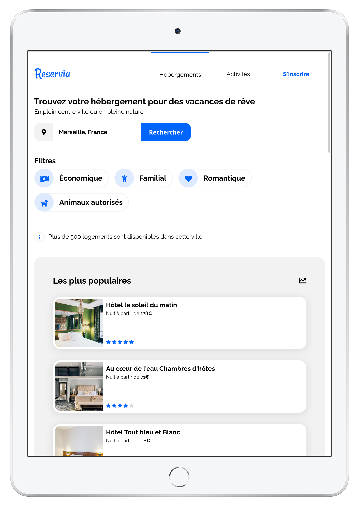
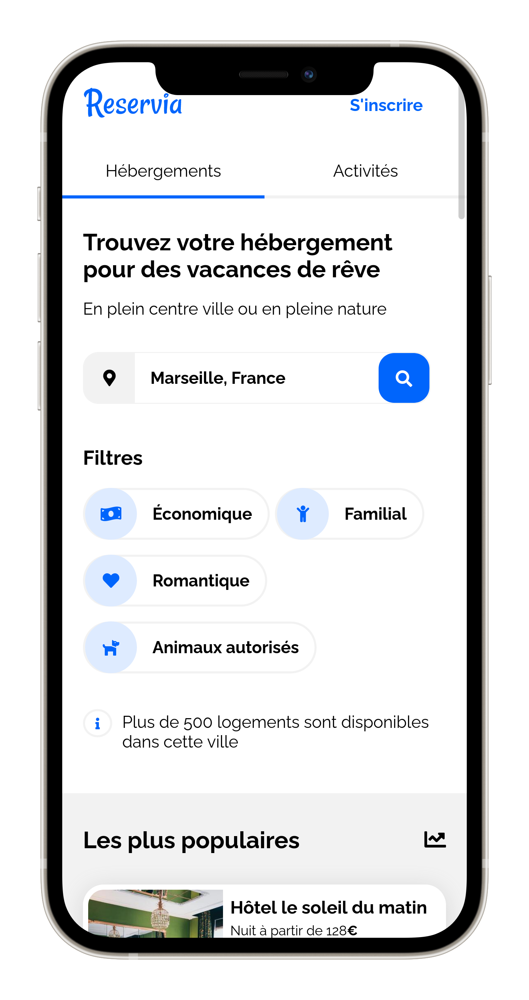
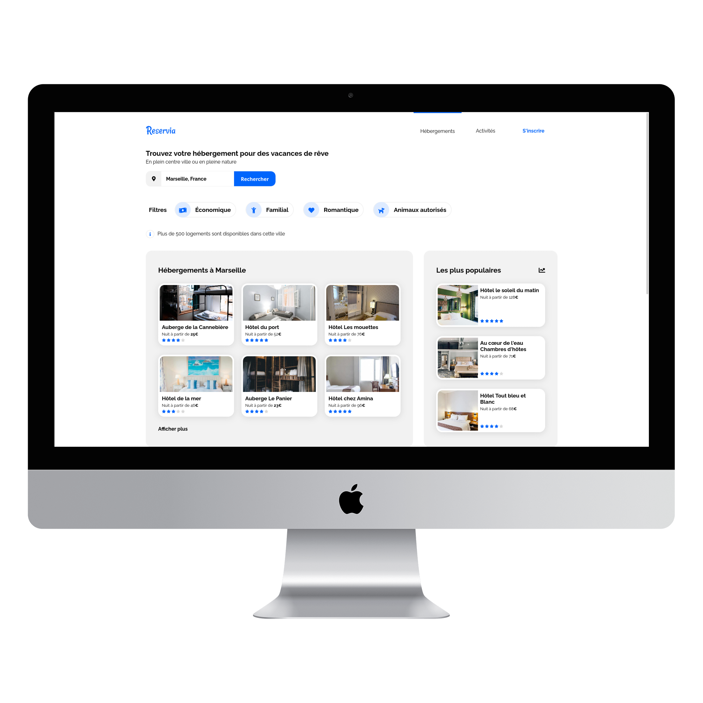
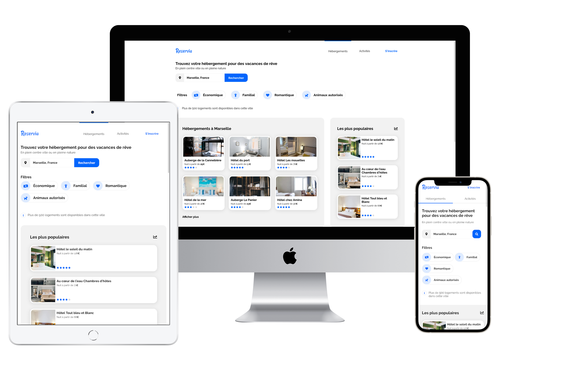

# ChristopheRomand_2_15092021

## OpenClassRooms Formation Développeur Web

### Projet numéro 2 "Transformez une maquette en site web"

<!-- 

    
    
    

 -->

### Scénario

Enfin, vous avez trouvé votre premier stage en tant que développeur web chez Reservia, une petite entreprise proposant un outil de planification de vacances. Leur site permet aux usagers de trouver des hébergements et des activités dans la ville de leur choix. Les hébergements peuvent également être filtrés par thématique, par exemple leur budget ou leur ambiance.

Un nouveau design basé sur les principes du Material Design vient d’être proposé par Loïc, designer UI.

**_Maquette desktop_**

